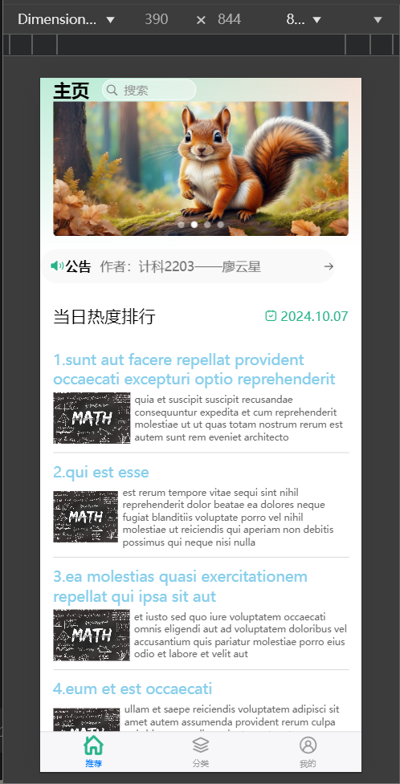
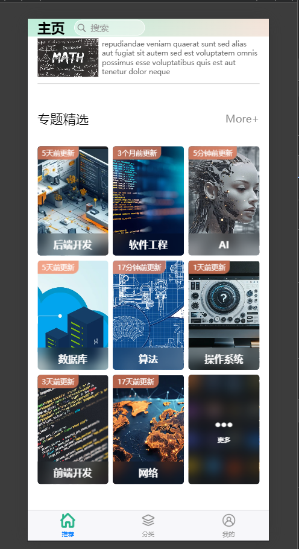
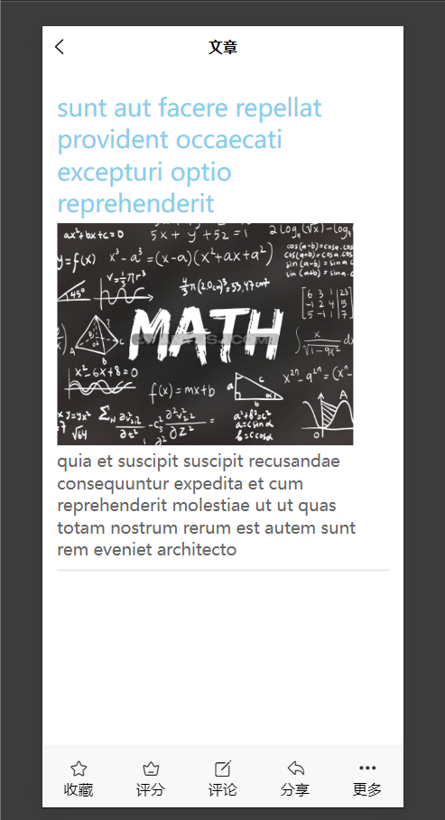
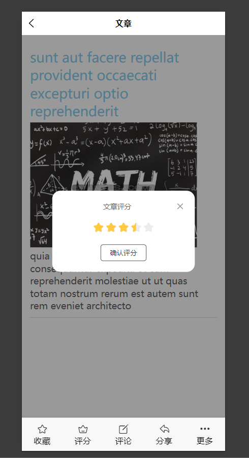
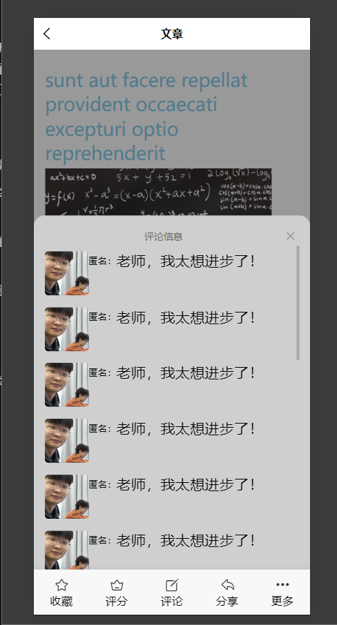
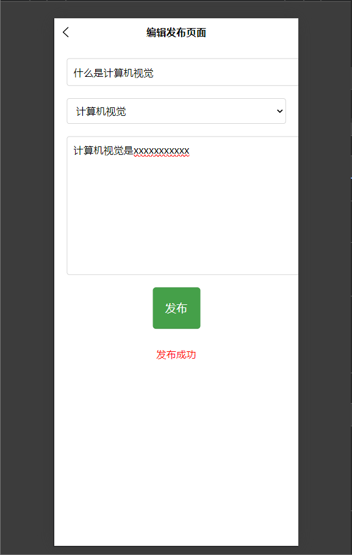
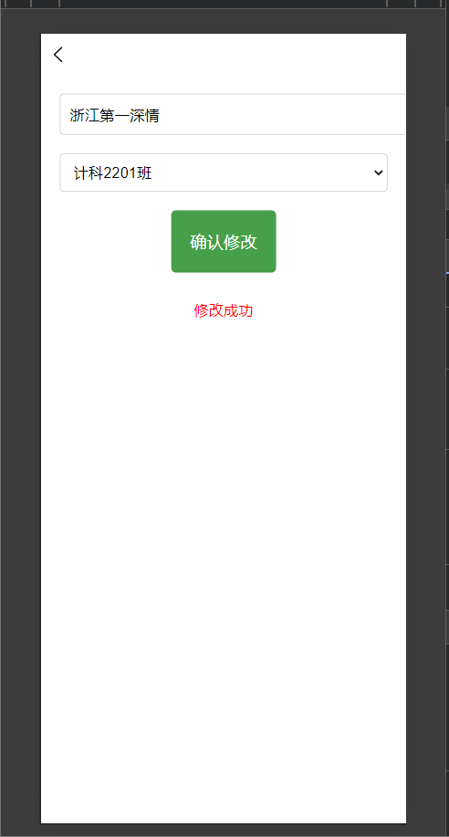

# blog_square

# blog_square说明文档

## 声明：本项目由于只有前端，大部分功能只能用于预览。

## 一、设计

### **1.项目简介**

简述博客广场网页的功能：

**“陨星博客广场”是一个集合了多种主题和热门资讯的平台。用户可以在首页浏览最新的公告和热门排行，根据不同的专题分类，快速找到感兴趣的内容。这个平台适合广大技术爱好者与学习者，通过各类学习专题和排行榜文章，用户能够快速获取优质内容并参与社区互动。**





从界面布局来看，主页上半页面展示了公告栏和当前的热门文章排行，用户可以通过点击查看详情。主页下半页面以网格形式展示了多个专题分类，如后端开发、AI、数据库等，帮助用户快速定位到自己想要的学习或阅读方向。

“陨星博客广场”的特点包括：

1. **公告和热榜**：及时显示最新的公告和当前热度最高的文章，方便用户了解最新动态。
2. **专题分类**：涵盖多个技术领域的专题内容，帮助用户在分类模块中深入学习相关技术或领域的文章。
3. **简洁的导航**：底部导航栏包含首页、分类、我的等功能，使得用户可以方便地在不同页面间切换。

### **2.功能概述**

- 用户可以在**主页**与**分类**页面查看自己想要浏览的博客类型，点击进去获得相应类型的博客文章列表。
- 用户可以在**主页**与**分类**页面搜索关键词，搜索到看自己想要浏览的博客文章。
- 用户在**博客文章**内可以对文章进行”收藏“、”评分“、”评论“、”分享“等功能。







- 用户登录成功后可以在**个人**页面进行”查看我的收藏“、”查看我的评分“，”联系客服“、”发布/管理个人博客文章”、”管理账号“、”退出登录“这些功能。
- 用户可以发布、编辑博客文章。
    
    
    
- 用户可以管理自己的账号信息，进行修改。



### **3.技术架构**

- 前端框架：使用 **Vue 3** 和 **uniapp**。
- 路由管理：pages.json文件。
- 后端服务和 API：文章列表的是用uni.repuest()对网页[https://jsonplaceholder.typicode.com/posts](https://jsonplaceholder.typicode.com/posts)发起Get方式的网络请求获取的。

### **4.页面设计**

- 简述主要页面的布局和风格：布局主要是文章垂直列表，分类页使用网格，各个页面的公共组件、公共样式、tabBar等设计
- 响应式设计：支持移动端及桌面端的适配，由于用的是uniapp的Hbuiler X，所有支持在多平台运行，页面布局大多有rpx设计，所以适配各个平台与设备。

## 二、工程笔记

### **1.开发工具**：

- 使用的开发工具: HBuilderX。
- 版本控制：Git 的使用。
- 列出遇到的主要问题及其解决方法。
    - 许多样式与块总是大片大片的，每一次写

### **2.项目结构**：

- 描述项目目录结构，如：
    - `common/`：管理一些图片与公共样式。
    - `components/`：可复用的组件。
    - `pages/`：存放各个页面。
    - `uni_modules/`：存放uniapp上下载来的扩展组件
    - `static/`：管理项目所需的静态资源
    
    其他的目录没动过，我也不知用来干嘛的。
    

### **3.代码实现的模板**：

- html用的是
    
    <template>
    
    <view></view>
    
    </template>
    
- javascript用的是
    
    <script setup>
    
    </script>
    
- css用的是
    
    <style lang="scss" scoped>
    
    </style>
    

*代码细节参照仓库具体内容！！！*

### **4.调试与测试**：

- 调试主要用chrome的检查区，通过console.log（res）来看函数是起作用，还有就是块的样式是否符合心里预期效果。

## 三、使用说明

### **1.安装与配置**：

- 在GitHub上下载zip后解压
- 在uniapp下载Hbuilder X，把解压后的所有文件在Hbuilder X打开（是用vue3！！！）
- 在Hbuilder X项目文件终端输入以下代码*（因为我在很多地方没有写对vue与uniapp的模块引入，提前配置的好就不用一次次引入了）*

```jsx
npm install unplugin-auto-import
```

- 下载chrome，并在Hbuilder X配置浏览器路由
- 点击pages/index/index.vue，点击运行到浏览器的”chrome就可以了
- 解释每个功能如何使用：
    - 如何发布文章：进入文章发布页面，填写标题、内容、分类等信息，点击“发布”按钮。
    - 如何编辑个人资料：进入个人资料页，修改相关信息后点击“确认修改”。

### **3.常见问题**：

- 有些时候网络不行的话，文章的网络api请求可能失败，这样就看不到文章与文章列表了。